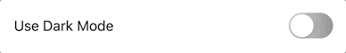
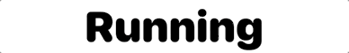

# SwiftUI
A repository for sharing custom SwiftUI components, styles and examples. These are generic versions of production assets that I'm using across my own projects, I hope you find them useful :)

---

### LinearGradientToggle

Toggle component/style with custom label & active/inactive gradients. Parameters for colors, width and length.

---

### LitDivider

Like a DIV but stacked with a highlight/shadow. Parameters for colors, width, length and orientation.

---

### SwapButtons

Button components that allow you to swap between two states (either two SwiftUI Symbols or two String labels). Also include the ability to revert back to their initial state based on a optional timed delay. Parameters for symbols/labels, colors, size, styles & delay.
